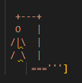

# Hangman
Hangman is a Python terminal game, which runs in the code institute mock terminal on Heroku.

Users can try to beat the crossword before the man gets hanged. Each wrong guessed letter puts the man 1 step closer to getting hanged. 

 
## How to play
Hangman on Python is based on the classic "Hangman" game. You can read more about it on [Wikipedia](https://en.wikipedia.org/wiki/Hangman_(game))
In this version, the player gets an short introduction to the game and gets asked to enter a letter. The letter will be auto capitalized.
When the player types a letter, it either gets added to the word bar, or one step is added to the hangman. 
The player has 7 chances to guess all the right letters, if guessed 7 or more times the player has lost. 
  
  
  
## Features

* Random words selected from a list

- The words are: 'PYTHON', 'JAVA', 'HTML', 'CSS', 'COMPUTER', 'LOTR',
    'RONALDO', 'LAPTOP', 'BROWSER', 'LOGITECH', 'APPLE'
- The player cannot see which word is chosen
- One part of the hangman is added per wrong guessed letter 

* Input validation and error-checking
    * You can only use letters
    * Numbers and symbols will give you error and asked to try again
    * You can only use 1 letter per chance
  
  
  
## Future Features

* Add more words 
* Can make it harder / easier depending if removing or adding extra lines to hangman
  
  
  
## Testing

I have manually tested this project by doing the following:

* Going through the game and lost.
* Going through the game and win.
* Entering symbols, letters and numbers. 
* Passed the code through a PEP8 linter and confirmed there are no problems.
    * Was some errors. regarding blank lines.
  
   
## Bugs

* Solved Bugs
- Weren't able to run game
  
  
  
  
## Remaining bugs

* No known ones
  
  
 
## Validator Testing

* PEP8
    * No errors except lining errors were returned from PEP8online.com
  
  
## Deployment

This project was deployed using Code Institute's mock terminal for Heroku.

* Steps for deployment:
    0.  Set up the workspace for Heroku
        * If you haven't already, create a Heroku account at https://signup.heroku.com/.
    1. Clone the repository
        * Clone this repository by running git clone https://github.com/Sajalol/Project3.Hangman.git.
        * Or navigate to https://github.com/Sajalol/Project3.Hangman and clone it through github.
    2. Create and set up a new Heroku app
        * Navigate to the Heroku dashboard and click on the 'New' button at the top right corner, then select 'Create new app'.
        * Enter a unique name for your app, select a region (preferably one closest to you) and click 'Create app'.
        * In the 'Settings' tab of your app, go to the 'Buildpacks' section and click 'Add buildpack'.
        * Add the Python and NodeJS buildpacks.
    3.  Deploy the app
        * Go to the 'Deploy' tab in the Heroku dashboard.
        * In the 'Deployment method' section, choose GitHub.
        * Connect your GitHub account and select the repository you want to deploy.
        * In the 'Automatic deploys' section, choose the branch you want to deploy (usually 'master' or 'main') and click 'Enable Automatic Deploys'.
        * Finally, click 'Deploy Branch' in the 'Manual deploy' section.
    4.  Open the app in browser
        * Once the build is complete, you can click 'Open app' in Heroku to access your application.
    5.  My deployed heroku link: [Heroku Link](https://stian-hangman-project.herokuapp.com/)
    
     

# Credits

* Code Institute for training and deployment terminal
* Wikipedia for info about Hangman
* The Hangman idea for python
* I would also like to acknowledge various online resources such as YouTube tutorials and StackOverflow posts that were of great help during the development process.

