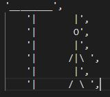

# Hangman
Hangman is a Python terminal game, which runs in the code institute mock terminal on Heroku.

Users can try to beat the crossword before the man gets hanged. Each wrong guessed letter puts the man 1 step closer to getting hanged. 

 
## How to play
Hangman on Python is based on the classic "Hangman" game. You can read more about it on [Wikipedia](https://en.wikipedia.org/wiki/Hangman_(game))
In this version, the player gets an short introduction to the game and gets asked to enter a letter. The letter must be capitalised.
The player can see how many letters the word is, and when the player types a letter. It either gets added to the word bar, or one step is added to the hangman. 
The player has 7 chances to guess all the right letters, if guessed 7 or more times the player has lost. 
  
  
  
## Features

* Random words selected from a list

- The words are: 'PYTHON', 'JAVA', 'HTML', 'CSS', 'COMPUTER', 'LOTR', 'RONALDO', 'LAPTOP', 'BROWSER', 'LOGITECH', 'APPLE'
- The player cannot see which word is chosen
- One part of the hangman is added per wrong guessed letter 

* Input validation and error-checking
    * You can only use letters
    * Numbers and symbols will give you error and asked to try again
  
  
  
  
## Future Features

* Add more words 
* Add cannot guess the same letter twice
* Can make it harder / easier depending if removing or adding extra lines to hangman
  
  
  
  
## Testing

I have manually tested this project by doing the following:

* Going through the game and lost.
* Going through the game and win.
* Entering symbols, letters and numbers. 
* Passed the code through a PEP8 linter and confirmed there are no problems.
    * Was some errors. regarding blank lines.
  
  
  
   
## Bugs

* Solved Bugs
- Weren't able to run game
  
  
  
  
## Remaining bugs

* Symbols are going through even though .isalpha() should not allow this. 
  
  
 
## Validator Testing

* PEP8
    * No errors except lining errors were returned from PEP8online.com

  
  
  
## Deployment

This project was deployed using Code Institute's mock terminal for Heroku.

* Steps for deployment:
    * Fork or clone this repository
    * Create a new Heroku app
    * Set the buildbacks to Python and NodeJS in that order
    * Link the Heroku app to the repository
    * Click on Deploy
    * [Heroku Link](https://stian-hangman-project.herokuapp.com/)

# Credits

* Code Institute for training and deployment terminal
* Wikipedia for info about Hangman
* Youtubers and google for assisting
* MiltonLn at github

